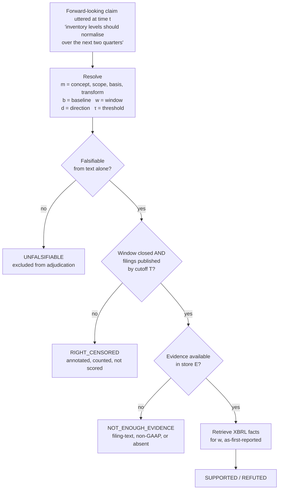
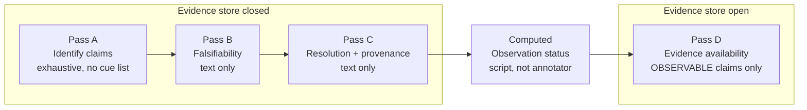
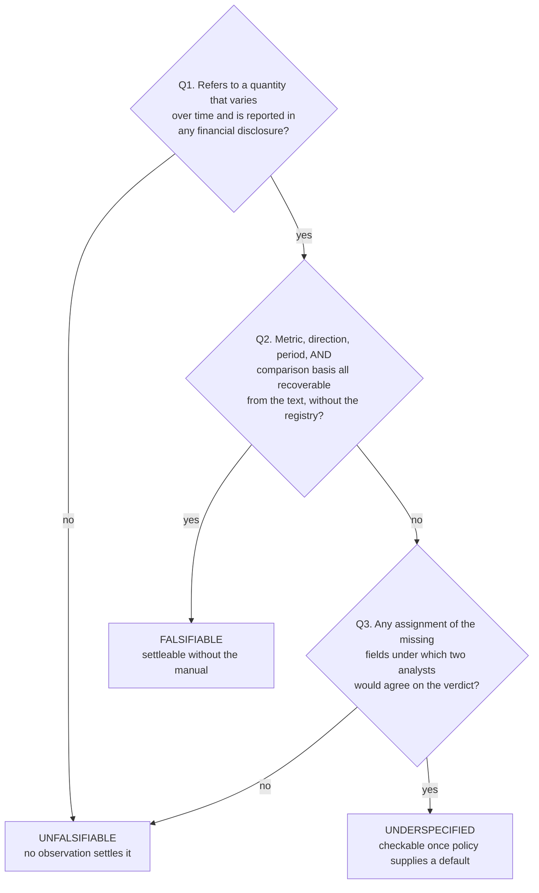
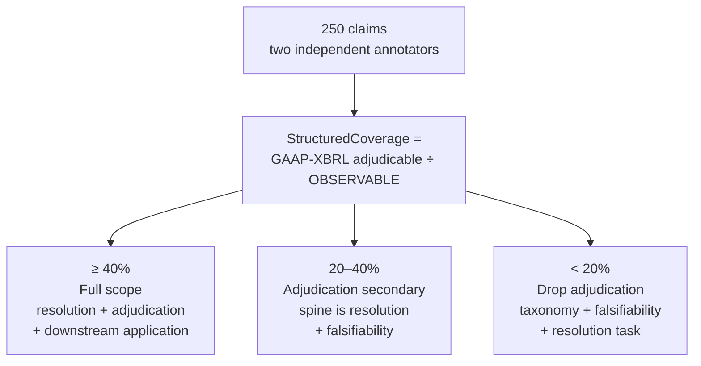

# Prospective Claim Verification

Resolving forward-looking claims from earnings calls into testable financial propositions, then checking them against financial facts published **after** the claim was made.

When a CFO says "we expect margins to improve next quarter", that is a prediction with a deadline. Three months later the company files a report containing the number that settles it. This project asks whether a model can turn the sentence into something checkable, wait for the filing, and decide whether the prediction held.

| | |
|---|---|
| **Status** | Design frozen. Pilot not yet run. |
| **Target** | ARR October 2026 cycle — submission 2026-10-12 |
| **Venue** | NAACL 2027 / COLING 2027 |
| **Study window** | 2012–2024, 120–150 large-cap filers |
| **Evidence store** | SEC Company Facts, the machine-readable financial data companies file with the regulator |

## Contents

| Section | What is in it |
|---|---|
| [Research question](#research-question) | The question and its three sub-questions |
| [Task](#task) | Resolution, adjudication, and the pipeline |
| [Annotation](#annotation) | Four passes and why the order matters |
| [Falsifiability](#falsifiability) | The three-way linguistic label |
| [Data](#data) | Sources, what constrains them, and what is licensable |
| [Pilot and decision gate](#pilot-and-decision-gate) | What 250 claims decide |
| [Repository](#repository) | Files and what each is for |
| [Status](#status) | What is done and what blocks the next step |
| [Glossary](#glossary) | Finance and filing terms used above |
| [Citation](#citation) | How to cite this work |
| [References](#references) | Peer-reviewed anchors |

## Research question

> Can NLP systems resolve forward-looking statements in corporate earnings calls into testable financial propositions, and subsequently verify those propositions against financial evidence that becomes available only in later reporting periods?

| | Question |
|---|---|
| **RQ1** | How accurately can models recover the metric concept, scope, accounting basis, transformation, baseline, temporal window, direction, and threshold implied by a forward-looking claim? |
| **RQ2** | Can models distinguish objectively testable forecasts from underspecified or intrinsically unfalsifiable corporate language? |
| **RQ3** | Given evidence published after the claim, can a system determine whether it was supported or refuted, and recognise when sufficient evidence is unavailable in the designated store? |

Existing financial claim-verification benchmarks verify claims against evidence that already exists, usually inside the same document. This task verifies against evidence that does not exist when the claim is made, which means the evaluation window is not given and has to be inferred.

## Task



Two properties of this order carry the design.

**Observability is decided before evidence is inspected.** A claim is OBSERVABLE when its window has closed *and* the filings covering that window have been published by the cutoff `T`. That test uses the filer's reporting calendar, not the existence of any particular fact, so it does not depend on the thing it gates.

**Adjudication is scored twice.** Binary SUPPORTED / REFUTED on the slice with GAAP-XBRL evidence, isolating comparison and arithmetic. Three-way including NEI over all falsifiable claims, measuring whether a system knows when it cannot check something. A system emitting NEI where evidence does exist is a retrieval failure, reported separately and never credited as correct abstention.

## Annotation

Four passes, each completed across all claims before the next begins.



Falsifiability is judged before resolution on purpose. Resolution means supplying policy defaults for missing fields, and an annotator who has just supplied a default baseline is primed to call the claim checkable. Judging falsifiability first keeps it a judgment about the sentence.

The two annotation axes are orthogonal and are annotated from different sources.

| Axis | Type | Annotated from | Values |
|---|---|---|---|
| Falsifiability | intrinsic | claim text only | falsifiable / underspecified / unfalsifiable |
| Evidence availability | extrinsic | the evidence store | GAAP-XBRL / filing-text / non-GAAP-only / absent |

Collapsing these into one label would teach a model where the SEC taxonomy has gaps rather than anything about language.

## Falsifiability



Q1 asks about *any* financial disclosure, not about the evidence store. A claim about adjusted EBITDA is falsifiable even though the structured data will not carry it, because EBITDA is a company-defined measure rather than a standard one; whether the store holds it is Pass D's question.

| Claim | Label |
|---|---|
| "Gross margin will exceed 71% in Q3." | FALSIFIABLE |
| "Adjusted EBITDA margin will be above 22% next quarter." | FALSIFIABLE |
| "Revenue will grow next quarter." | UNDERSPECIFIED |
| "Inventory should normalise over the next two quarters." | UNDERSPECIFIED |
| "We remain excited about the long-term opportunity." | UNFALSIFIABLE |

FALSIFIABLE means self-contained, so it is expected to be the smaller class, concentrated in threshold and range claims. Both FALSIFIABLE and UNDERSPECIFIED go to adjudication, stratified.

## Data

All real, all public. Nothing synthetic.

| Data | Source | Cost | Status |
|---|---|---|---|
| Earnings call transcripts | `RudrakshNanavaty/earnings-call-data` (HuggingFace) — 183k rows, 2005–2025, 685 tickers across 496 companies | Free | Verified, not yet pulled |
| Financial facts | SEC Company Facts, `data.sec.gov` | Free, no API key | Verified, not yet pulled |
| Filing dates | SEC EDGAR submissions API | Free, no API key | Verified, not yet pulled |
| Earnings-miss labels | Alpha Vantage `EARNINGS` endpoint — reported and estimated EPS, surprise, surprise percentage | Paid tier | Verified, needed only for the downstream task |

Study window 2012–2024, 120–150 large-cap filers.

Four properties of the data shape the design, and each one closed off an easier version of the project.

**Structured financial data does not reach back to 2005.** XBRL tagging was phased in for periods ending on or after June 2009 for the largest filers, June 2010 for other large accelerated filers, and June 2011 for everyone else. Transcripts run from 2005, but adjudication cannot start until roughly 2011, which is why the window begins in 2012.

**Non-GAAP measures are absent from the structured data.** A great deal of guidance is issued on adjusted EBITDA, non-GAAP margins, or constant-currency revenue, and companies routinely decline to reconcile forward-looking non-GAAP figures to GAAP. None of those exist as XBRL facts, so some of the most specific-sounding claims in the corpus are the least checkable. How much of the corpus this removes is exactly what the pilot measures.

**Filed values get revised.** Company Facts serves the current value of a concept, including restatements. The adjudicator uses as-first-reported values, because a restatement issued later would leak information that was not available when the claim was made.

**Fiscal calendars do not align.** Non-standard year ends, 52- and 53-week retail calendars, and "next year" meaning a fiscal year ending the following January. This is unglamorous work and a real source of label noise, so it gets its own module and its own tests.

Transcripts are owned by their providers, so a released dataset carries claim spans, character offsets, resolutions, and labels, plus a script that reconstructs the text from its source. That constraint is a design input, not something to resolve later.

## Pilot and decision gate

250 claims, two annotators, drawn from exhaustively annotated passages so the denominator is unbiased.



The rule is written before the numbers arrive. A gate whose every outcome can be described as an interesting finding is not a test. All three branches are real papers; the third is the calmer six weeks.

Reported alongside it: per-field Cohen's kappa, censoring rate split by reason, the numerical/qualitative proportion, and median annotation minutes per claim.

## Repository

```text
.
├── README.md                     This file. Task, annotation scheme, data, and the decision gate.
├── annotation-guidelines.md      Annotation manual. Frozen; changes need a version bump and a change-log entry.
├── LICENSE                       CC BY 4.0 for documents and data, MIT for code.
├── CITATION.cff                  Machine-readable citation metadata.
│
├── data/                         Not committed. Obtained by the documented steps.
│   ├── README.md
│   ├── raw/README.md             Transcripts and XBRL facts exactly as pulled. Never edited.
│   ├── interim/README.md         Intermediate, regenerable.
│   └── processed/README.md       The splits every experiment reads. Temporal, frozen before annotation.
│
├── reference/                    Committed. Version-locked to the annotation manual.
│   ├── README.md
│   ├── metric_classes.csv        metric -> FLOW or LEVEL, selects the default baseline.
│   ├── fiscal_calendar.csv       cik -> fiscal year end, 52/53-week flag.
│   ├── filing_dates.csv          cik, fiscal_period, form_type, filed_date.
│   └── evidence_cutoff.txt       The single cutoff date T.
│
├── annotations/
│   ├── README.md
│   ├── passages.jsonl            Sampled passages with exhaustive claim counts. Carries the denominator.
│   ├── claims.jsonl              One record per claim per annotator.
│   └── policy_gaps.md            Cases the policy registry does not cover.
│
├── src/                          Importable code, no side effects.
│   ├── README.md
│   ├── constants.py              Paths, seeds, cutoff. Standard library only.
│   ├── config.py                 Pydantic models with validation at construction.
│   ├── common.py                 Loading, seeding, table and figure I/O.
│   ├── run_logging.py            Console output, log files, output prefixes.
│   ├── edgar/README.md           Filing dates, fiscal calendars, Company Facts.
│   ├── resolution/README.md      Claim text to a structured proposition.
│   └── adjudication/README.md    Observation status, evidence lookup, verdicts.
│
├── scripts/                      Numbered, runnable, produce results.
│   ├── README.md
│   ├── 00_pull_transcripts.py
│   ├── 01_build_reference_tables.py
│   ├── 02_sample_passages.py
│   ├── 03_compute_observation_status.py
│   ├── 06_make_report_figures.py
│   ├── 07_build_repro_artifacts.py
│   └── 08_verify_invariants.py
│
├── reports/
│   ├── README.md
│   ├── tables/README.md          Written only through the shared writer.
│   ├── figures/README.md         Rendered from builders in src, never defined in a notebook.
│   ├── logs/README.md            One timestamped log per run. Not committed.
│   └── repro/README.md           Environment, seeds, artifact inventory.
│
└── notebooks/
    └── README.md                 Read results and interpret them. Generate nothing.
```

Every directory carries a README stating what lives there, what writes it, and whether it is committed. The code and data files listed above do not exist yet; the directories and their READMEs do, so the manual's references to `metric_classes.csv`, `fiscal_calendar.csv` and `filing_dates.csv` resolve to a known place.

Artifacts in `reports/` carry the prefix of the script that produced them, so provenance is readable from a filename. `08_verify_invariants.py` fails on any artifact whose prefix matches no script.

## Status

Nothing has been pulled and nothing has been annotated.

The data comes before the pilot, not after. An earlier reading of the plan had the pilot as the first gate, but 250 annotated claims cannot exist without transcripts, and `StructuredCoverage` cannot be computed without filing dates and XBRL facts. Acquisition is the first task.

Three companion tables block the pilot, and two of the three are pure data-engineering with no annotation involved.

| File | Needed by | Contents |
|---|---|---|
| `metric_classes.csv` | Pass C | metric → FLOW or LEVEL, for the baseline defaults |
| `fiscal_calendar.csv` | Pass C | cik → fiscal year end, 52/53-week flag |
| `filing_dates.csv` | observation status | cik, fiscal_period, form_type, filed_date |

`filing_dates.csv` is what makes the evidence maturity date computable. The fiscal calendar maps "next quarter" onto a period; it cannot say when the report covering that period was filed.

The next thing that can change this project is the pilot. Further conceptual review has reached diminishing returns.

## Glossary

Terms used above, for readers coming from outside finance.

| Term | What it means |
|---|---|
| **8-K** | A filing for events between scheduled reports. The earnings press release is usually an attachment to one. |
| **10-Q / 10-K** | The quarterly and annual reports a US public company must file. |
| **ARR** | ACL Rolling Review, the shared reviewing system for the main natural language processing conferences. |
| **As-first-reported** | The value as originally filed, before any later restatement. Using restated values would leak information that was not available at the time. |
| **CIK** | The SEC's unique identifier for a filer. |
| **Cohen's kappa** | A measure of agreement between two annotators that corrects for agreement by chance. |
| **Company Facts** | The SEC endpoint serving those tagged values for a given company. |
| **Consensus estimate** | The average of analysts' forecasts for a figure. Beating or missing it is what "earnings surprise" refers to. |
| **Earnings call** | A quarterly conference call where a company's executives discuss results and answer analyst questions. Split into prepared remarks and a Q&A session. |
| **Earnings miss** | Reported results below the consensus estimate. |
| **EBITDA** | Earnings before interest, taxes, depreciation and amortisation. A widely used non-GAAP profitability measure. |
| **EDGAR** | The SEC's public database of those filings. Free, no key required. |
| **EPS** | Earnings per share. Net profit divided by shares outstanding. |
| **Filing date** | When a report actually reached the SEC. Distinct from the period it covers, and often weeks later. |
| **Fiscal quarter** | A company's own accounting quarter. Not necessarily aligned to the calendar; some retailers use 52- or 53-week years. |
| **GAAP** | Generally Accepted Accounting Principles, the standard US rules for how a figure must be calculated. What XBRL tags. |
| **Guidance** | A forward-looking statement by management about expected future performance. |
| **NEI** | Not Enough Information. The standard third label in fact-verification work, alongside supported and refuted. |
| **Non-GAAP** | A company-defined adjustment to a GAAP figure, such as excluding one-off costs. Common in guidance, and not present in XBRL, which is the central constraint on this project. |
| **SEC** | The US Securities and Exchange Commission, the regulator public companies file with. |
| **XBRL** | A tagging standard that makes filed financial statements machine-readable, so "revenue" can be looked up as a labelled field rather than parsed out of a PDF. |

## References

Peer-reviewed anchors for the task, the annotation axes, and the accounting literature the design builds on.

| Work | Venue | Relevance |
|---|---|---|
| Zhao et al., FinDVer | EMNLP 2024 | Closest NLP benchmark; verifies against contemporaneous evidence |
| Shah et al., NumClaim | FEVER @ ACL 2024 | Numerical claim detection; baseline for the numerical subset |
| Lin et al., Argument-Based Sentiment on Forward-Looking Statements | Findings of ACL 2024 | Forward-looking language, equity research reports |
| Pardawala et al., SubjECTive-QA | NeurIPS 2024 D&B | Earnings-call QA subjectivity; adjacent to falsifiability |
| Aly et al., FEVEROUS | NeurIPS 2021 D&B | SUPPORTED / REFUTED / NEI over structured evidence |
| Rogers & Stocken, Credibility of Management Forecasts | The Accounting Review 2005 | Management forecast credibility |
| Huang, Teoh & Zhang, Tone Management | The Accounting Review 2014 | Abnormal tone; why NRD is not a novelty claim |
| Gow, Larcker & Zakolyukina, Non-Answers During Conference Calls | JAR 2021 | Non-answers as a disclosure choice |

## Citation

If you use this repository, its annotation guidelines, or any derived annotations, cite it. Commercial use is fine and no permission is needed, but under CC BY 4.0 attribution is a condition of use rather than a courtesy: using the material without credit falls outside the licence.

```bibtex
@misc{hasan2026prospective,
  author = {Hasan, Doula Isham Rashik},
  title  = {Prospective Claim Verification: Checking Forward-Looking Corporate
            Statements Against Evidence That Does Not Exist Yet},
  year   = {2026},
  note   = {Version 0.1.0},
  url    = {https://github.com/di37/prospective-claims}
}
```

`CITATION.cff` carries the same metadata in machine-readable form, which is what produces the "Cite this repository" button on GitHub.

If a paper comes out of this work, cite that instead and this repository in addition where the annotation scheme or the released annotations are used directly.

## License

Open source and commercially usable. You may use, copy, modify, redistribute, and build products on this work, including for profit, without asking permission and without paying anything.

**The one condition is attribution.** Cite it. That is the whole trade.

Dual-licensed, because the two kinds of material have different needs. See [LICENSE](LICENSE).

| Material | Licence | You may | You must |
|---|---|---|---|
| Annotation guidelines, README, released annotations and reference tables | CC BY 4.0 | Use commercially, adapt, redistribute | Credit the author, link the licence, note any changes |
| Source code in `src/` and `scripts/` | MIT | Use commercially, adapt, redistribute, sublicense | Preserve the copyright notice |

Documentation and data are CC BY 4.0 rather than MIT specifically so that attribution is enforceable. MIT permits use with no credit beyond the copyright notice, which would not oblige anyone to cite this work. CC BY 4.0 keeps commercial use fully open while making the citation a term of the licence rather than a request.

Neither licence extends to earnings-call transcripts, which remain the property of their providers, or to SEC filing content. Released datasets carry claim spans, character offsets, resolutions, and labels, plus a script that reconstructs the text from its source.
