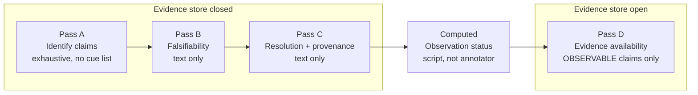

# Annotation

Four passes over the claims, each completed across all of them before the next begins. The order is part of the design rather than a workflow convenience.

Falsifiability is judged before resolution on purpose. Resolution means supplying policy defaults for missing fields, and an annotator who has just supplied a default baseline is primed to call the claim checkable. Judging falsifiability first keeps it a judgment about the sentence.

The two annotation axes are orthogonal and are annotated from different sources.

| Axis | Type | Annotated from | Values |
|---|---|---|---|
| Falsifiability | intrinsic | claim text only | falsifiable / underspecified / unfalsifiable |
| Evidence availability | extrinsic | the evidence store | GAAP-XBRL / filing-text / non-GAAP-only / absent |

Collapsing these into one label would teach a model where the SEC taxonomy has gaps rather than anything about language.

---

The rules themselves are in [`annotation-guidelines.md`](annotation-guidelines.md), which is frozen and versioned. This page is the shape; that document is the manual.
