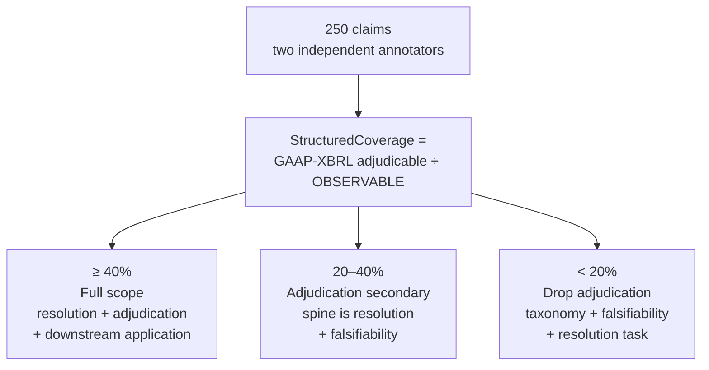

# Pilot and decision gate

What 250 annotated claims decide, and the rule written before the numbers arrive.

Two annotators, drawn from exhaustively annotated passages so the denominator is unbiased.

The rule is written before the numbers arrive. A gate whose every outcome can be described as an interesting finding is not a test. All three branches are real papers; the third is the calmer six weeks.

Reported alongside it: per-field Cohen's kappa, censoring rate split by reason, the numerical/qualitative proportion, and median annotation minutes per claim.

---

The measure the gate turns on depends on the sources in [data](data.md) and the labels in [annotation](annotation.md).
