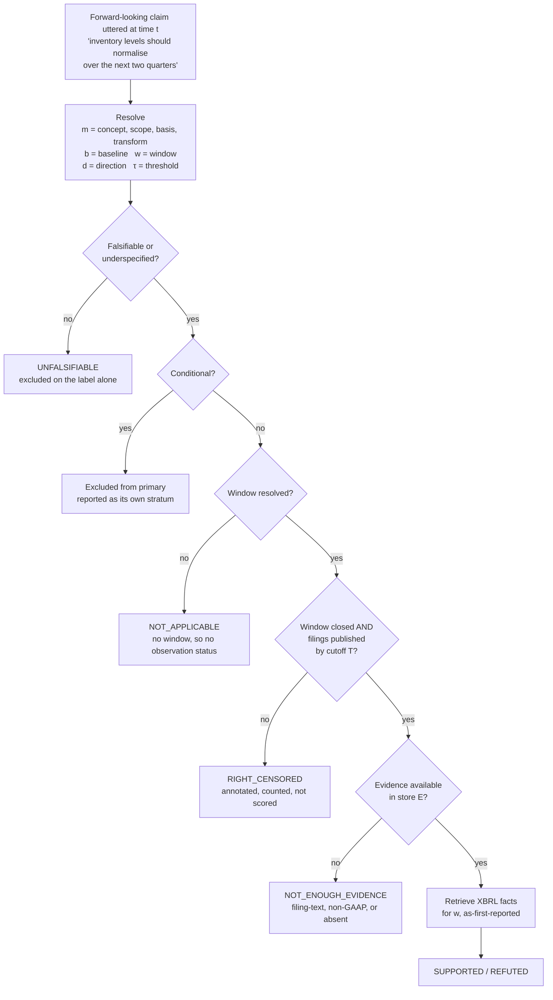
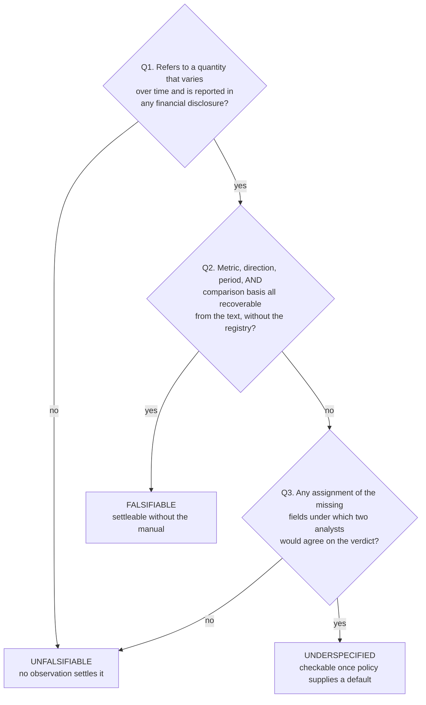

# The task

What the system is asked to do with a forward-looking claim, and the label that decides whether it is worth asking.

Two properties of this order carry the design.

**Observability is decided before evidence is inspected.** A claim is OBSERVABLE when its window has closed *and* the filings covering that window have been published by the cutoff `T`. That test uses the filer's reporting calendar, not the existence of any particular fact, so it does not depend on the thing it gates.

**Adjudication is scored twice.** Binary SUPPORTED / REFUTED on the slice with GAAP-XBRL evidence, isolating comparison and arithmetic. Three-way including NEI over the adjudication-eligible FALSIFIABLE and UNDERSPECIFIED claims, after the exclusions below, measuring whether a system knows when it cannot check something. A system emitting NEI where evidence does exist is a retrieval failure, reported separately and never credited as correct abstention.

## Falsifiability

Q1 asks about *any* financial disclosure, not about the evidence store. A claim about adjusted EBITDA is falsifiable even though the structured data will not carry it, because EBITDA is a company-defined measure rather than a standard one; whether the store holds it is Pass D's question.

| Claim | Label |
|---|---|
| "Gross margin will exceed 71% in Q3." | FALSIFIABLE |
| "Adjusted EBITDA margin will be above 22% next quarter." | FALSIFIABLE |
| "Revenue will grow next quarter." | UNDERSPECIFIED |
| "Inventory should normalise over the next two quarters." | UNDERSPECIFIED |
| "We remain excited about the long-term opportunity." | UNFALSIFIABLE |

FALSIFIABLE means self-contained, so it is expected to be the smaller class, concentrated in threshold and range claims.

FALSIFIABLE and UNDERSPECIFIED claims are both *eligible* for adjudication, and results are stratified by the two. Eligible is not the same as included: a claim is still dropped if its evaluation window is UNRESOLVED, if it is right-censored, or if it is conditional. Only UNFALSIFIABLE is excluded on the strength of the label alone.

---

Next: [how humans annotate this](annotation.md), or [five claims worked end to end](worked-examples.md).
