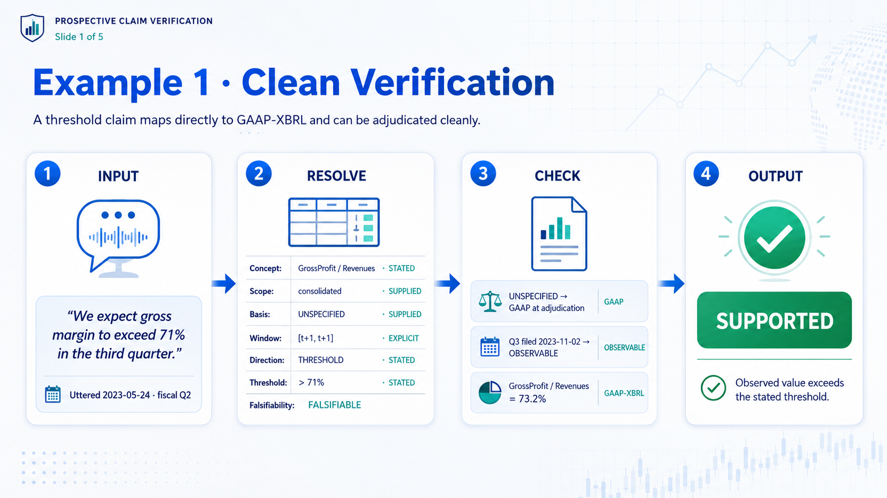
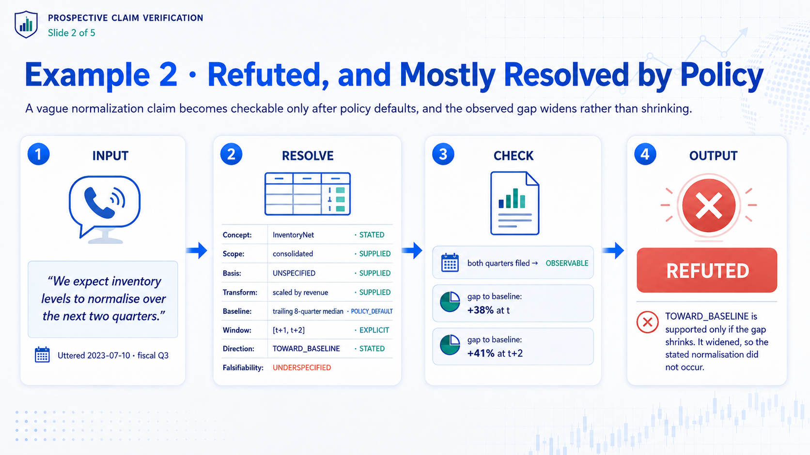
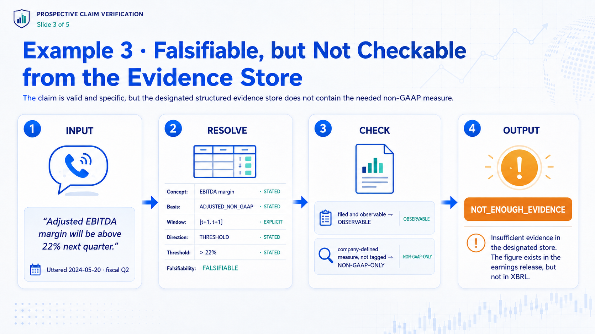
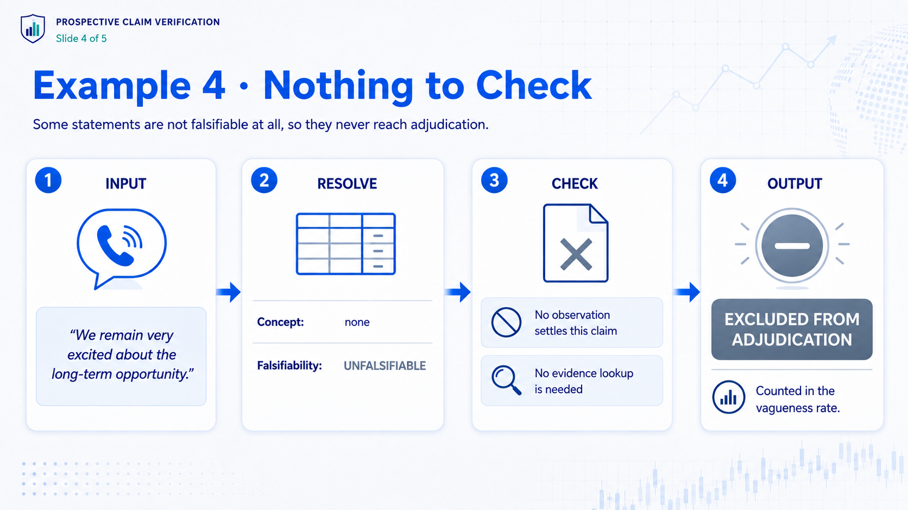
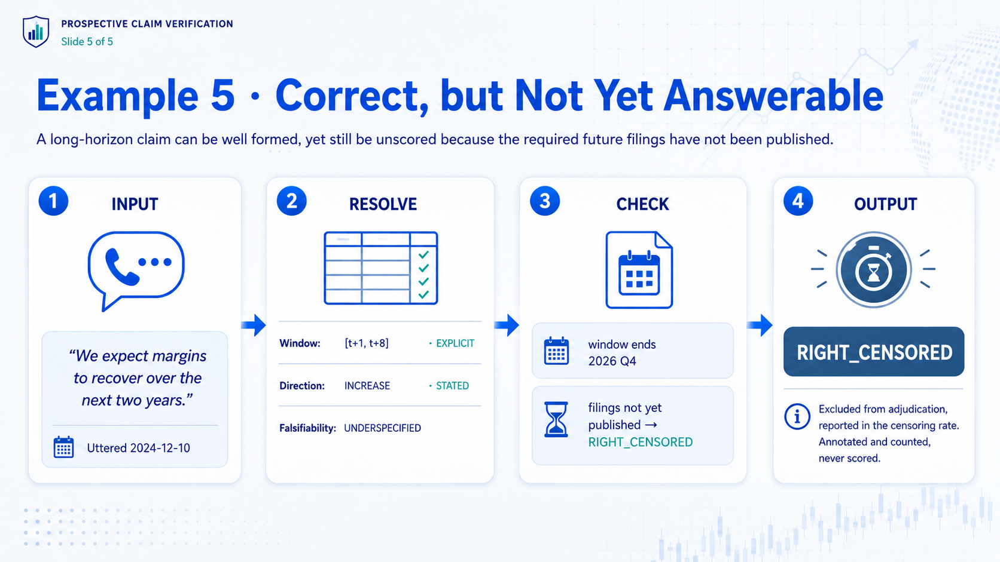

# Worked examples

Five claims taken end to end. Between them they cover every outcome the task can produce.

The sentences are written for this page rather than quoted from any particular company, and that is a requirement rather than a shortcut: transcripts are third-party content this project does not redistribute, so a worked example built from a real call could not be published here. Everything else on the page, the fields, the policy defaults, the verdicts, is exactly what the manual produces.

## 1. Clean verification



A threshold claim needs no baseline, and the metric maps directly onto a tagged GAAP concept.

<details>
<summary>The same claim as the annotator records it</summary>

```
INPUT    "We expect gross margin to exceed 71% in the third quarter."
         uttered 2023-05-24, fiscal Q2

RESOLVE  concept    GrossProfit / Revenues        STATED
         scope      consolidated                  SUPPLIED
         basis      UNSPECIFIED                   SUPPLIED
         window     [t+1, t+1]                    EXPLICIT
         direction  THRESHOLD                     STATED
         threshold  > 71%                         STATED
         falsifiability  FALSIFIABLE

CHECK    UNSPECIFIED maps to GAAP at adjudication, per section 5.2
         Q3 filed 2023-11-02, before cutoff  ->  OBSERVABLE
         GrossProfit / Revenues = 73.2%      ->  GAAP-XBRL

OUTPUT   SUPPORTED
```

</details>

## 2. Refuted, and mostly resolved by policy



"Normalise" carries no number, so the manual supplies the baseline. The provenance column is what stops the model getting credit for the manual's work.

<details>
<summary>The same claim as the annotator records it</summary>

```
INPUT    "We expect inventory levels to normalise over the next two quarters."

RESOLVE  concept    InventoryNet                  STATED
         scope      consolidated                  SUPPLIED
         basis      UNSPECIFIED                   SUPPLIED
         transform  scaled by revenue             SUPPLIED
         baseline   trailing 8-quarter median     POLICY_DEFAULT
         window     [t+1, t+2]                    EXPLICIT
         direction  TOWARD_BASELINE               STATED
         falsifiability  UNDERSPECIFIED

CHECK    both quarters filed  ->  OBSERVABLE
         gap to baseline: +38% at t, +41% at t+2

OUTPUT   REFUTED
         TOWARD_BASELINE is supported only if the gap shrinks. It widened,
         so the stated normalisation did not occur
```

</details>

## 3. Falsifiable, but not checkable from the evidence store



The most important failure case, and the one the pilot measures. Nothing is wrong with the sentence; the measure simply does not exist as structured data.

<details>
<summary>The same claim as the annotator records it</summary>

```
INPUT    "Adjusted EBITDA margin will be above 22% next quarter."

RESOLVE  concept    EBITDA margin                 STATED
         basis      ADJUSTED_NON_GAAP             STATED
         window     [t+1, t+1]                    EXPLICIT
         direction  THRESHOLD                     STATED
         threshold  > 22%                         STATED
         falsifiability  FALSIFIABLE

CHECK    filed and observable                ->  OBSERVABLE
         company-defined measure, not tagged ->  NON-GAAP-ONLY

OUTPUT   NOT_ENOUGH_EVIDENCE
         insufficient evidence in the designated store, which is not
         the same as the figure not existing: it is in the earnings
         release, just not in XBRL
```

</details>

## 4. Nothing to check



No observation settles this, so it never reaches adjudication. The rate at which management produces these is itself a signal.

<details>
<summary>The same claim as the annotator records it</summary>

```
INPUT    "We remain very excited about the long-term opportunity."

RESOLVE  concept    none
         falsifiability  UNFALSIFIABLE

OUTPUT   excluded from adjudication, counted in the vagueness rate
```

</details>

## 5. Correct, but not yet answerable



A long horizon is not a defect in the claim. Treating it as missing evidence would be a mistake, and would penalise the model for inferring the window correctly.

<details>
<summary>The same claim as the annotator records it</summary>

```
INPUT    "We expect margins to recover over the next two years."
         uttered 2024-12-10

RESOLVE  window     [t+1, t+8]                    EXPLICIT
         direction  INCREASE                      STATED
         falsifiability  UNDERSPECIFIED

CHECK    window ends 2026 Q4, filings not yet published
                                             ->  RIGHT_CENSORED

OUTPUT   excluded from adjudication, reported in the censoring rate
         annotated and counted, never scored
```

</details>

---

The rules these examples apply are in [`annotation-guidelines.md`](../annotation/annotation-guidelines.md); the outcomes are defined in [the task](../task/task.md).
